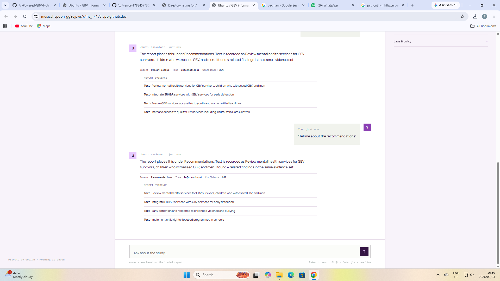
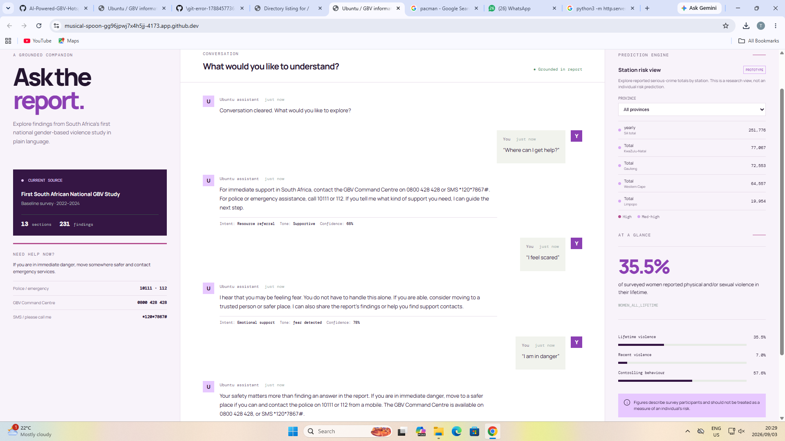
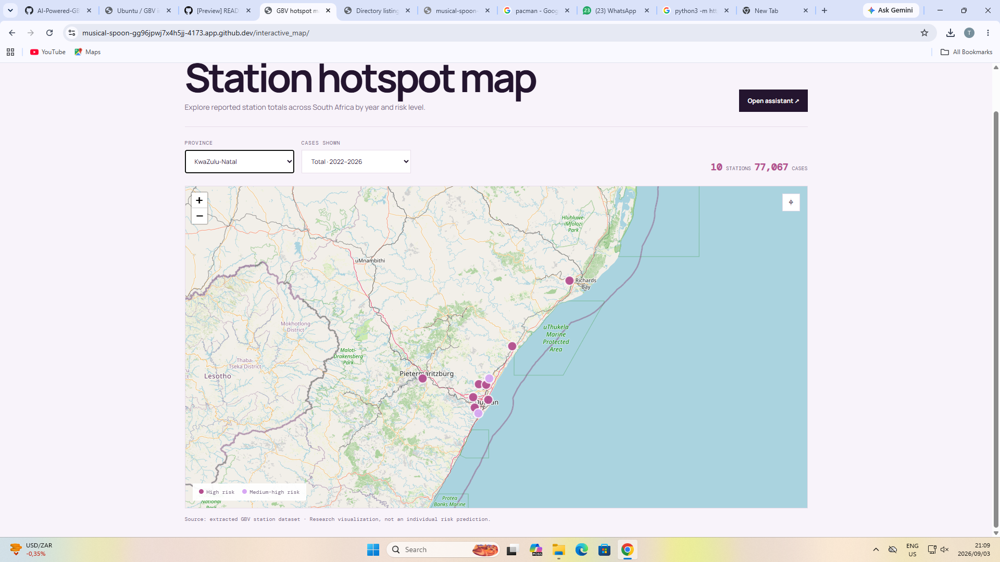
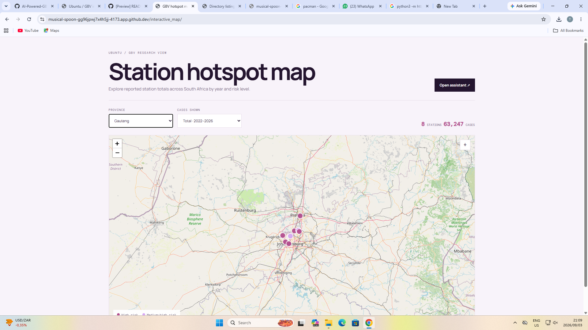

# AI-Powered GBV Hotspot Prediction and Support System

An exploratory research project for collecting, preprocessing, analyzing, and visualizing publicly available gender-based violence (GBV) data in South Africa. The project combines machine-learning notebooks with two browser interfaces:

- An interactive station hotspot map for geographic exploration
- A grounded GBV information and emotional-support chatbot

The project is intended for research, education, and prototype demonstration. It is not an emergency service, a clinical tool, a law-enforcement decision system, or an individual risk predictor.

## Project objectives

1. Collect and analyze publicly available GBV-related datasets.
2. Clean and prepare station, geographic, yearly-count, and report data.
3. Engineer features for clustering and supervised learning.
4. Explore hotspot detection using geographic and historical case features.
5. Explore risk classification using supervised machine-learning models.
6. Provide a user-friendly interface for map visualization and report exploration.
7. Present safety resources without storing user conversations.

## Repository structure

```text
.
├── chatbot/
│   ├── index.html       # Integrated chatbot and station-risk dashboard
│   ├── styles.css       # Chatbot and dashboard styling
│   ├── app.js           # Report search, support signals, and embedded map logic
│   └── README.md        # Chatbot and dashboard documentation
├── interactive_map/
│   ├── index.html       # Standalone map page
│   ├── styles.css       # Standalone map styling
│   ├── app.js           # Standalone map logic and embedded station data
│   └── README.md        # Standalone map documentation
├── datasets/
│   ├── 2020-2026-political-related-sexual-violence-incident-data (2).csv
│   └── full-report-the-first-south-african-national-gender-based-violence-study-2022.txt
├── extracted_datasets/
│   ├── 2025-2026_-_4th_Quarter_WEB.xlsx - Prov TOP30 stations.csv
│   ├── GBV Dataset.csv
│   └── gbv_data.xlsx - Sheet1.csv
├── python_notebooks/
│   ├── classification.ipynb
│   ├── emotional_support.ipynb
│   ├── GBV Model (3).ipynb
│   └── hotspot_detection.ipynb
└── 
```

## Data sources and scope

The project uses publicly available sources related to GBV, sexual violence, and South African crime statistics. The main sources include:

- [South African Police Service crime statistics](https://www.saps.gov.za/services/crimestats.php)
- [GBVF Response Fund SAPS data visualization](https://www.gbvfresponsefund1.org/dashboards/saps-data-visualisation/)
- [Conflict-related sexual violence data](https://data.humdata.org/dataset/conflict-related-sexual-violence)
- The First South African National Gender-Based Violence Study, 2022

The repository contains both source files and extracted/working CSV files. The current station map uses `extracted_datasets/GBV Dataset.csv`, a semicolon-delimited dataset with these fields:

| Field | Description |
| --- | --- |
| `Province` | South African province |
| `Station` | Police station name |
| `Latitude`, `Longitude` | Station coordinates |
| `Risk` | Source risk label, currently `High` or `Med-high` |
| `2022`–`2026` | Reported case count for each year |
| `TOTAL` | Combined count for the available years |

The map currently contains 30 usable station records. Province summary rows and national totals do not have station coordinates, so they are excluded from plotted markers.

## Data preprocessing and feature engineering

The project preprocessing work includes:

1. Removing report banners, metadata rows, empty layout columns, structural headers, and footer rows from exported SAPS tables.
2. Standardizing column names by stripping whitespace, converting to lowercase, and replacing spaces with underscores.
3. Removing duplicate records and rows without critical province or station values.
4. Converting comma-formatted strings into numeric case counts.
5. Coercing invalid or missing numeric values to usable values, with missing crime counts represented as zero where appropriate.
6. Cleaning latitude and longitude fields, including removal of stray `=` characters.
7. Reshaping yearly counts between wide and long formats for analysis and visualization.
8. Scaling numerical features with `StandardScaler` for distance-based clustering and model inputs.
9. Creating an ordinal risk target with quantile-based levels such as `Low Risk`, `Medium Risk`, and `High Risk` in the hotspot notebook.
10. Encoding categorical targets with `LabelEncoder` for supervised learning experiments.

The report-classification notebook additionally creates:

- A cleaned `notes` field
- A numeric representation of report values
- A combined text field from indicators and notes
- TF-IDF text features
- Imputed and scaled numerical features
- A combined feature matrix for a Random Forest classifier

## Machine-learning work

### Hotspot detection and clustering

`python_notebooks/hotspot_detection.ipynb` prepares station-level historical crime-period features for clustering and supervised experiments. The workflow includes data cleaning, feature scaling, quantile-based risk tiers, and train/test preparation for future K-Means, DBSCAN, and related analysis.

The current web map is a visualization of station records. It does not claim to generate live clustering predictions. Clustering outputs should be interpreted alongside the notebook preprocessing and evaluation work.

### Risk classification

`python_notebooks/GBV Model (3).ipynb` explores supervised classification of station risk labels using geographic coordinates and reported totals. The notebook compares models including:

- Logistic Regression
- K-Nearest Neighbours
- Decision Tree
- Random Forest
- Support Vector Machine
- Gaussian Naive Bayes
- Gradient Boosting
- Multi-layer Perceptron

It includes train/test splitting, feature scaling, model training, predictions, accuracy, precision, recall, F1 score, and comparison plots.

`python_notebooks/classification.ipynb` focuses on classifying sections of the national GBV study from text and numerical report content. It uses TF-IDF features, numeric imputation, scaling, a combined feature matrix, and a Random Forest demonstration.

## Browser interfaces

### 1. Standalone interactive map

The standalone map is in `interactive_map/` and is the recommended download for map demonstrations. It provides:

- Interactive station markers across South Africa
- High-risk and medium-high-risk marker colors
- Province filtering
- Year filtering for `2022` through `2026` and combined `TOTAL`
- Clickable station details
- Active station and case totals
- A reset control to refit the visible stations
- Responsive desktop and mobile layout

The standalone package is intentionally portable. `index.html`, `styles.css`, and `app.js` are sufficient to display the station records when downloaded together. The station records are embedded in `app.js`, so the page does not depend on a repository-relative CSV when opened directly from disk. When served from the repository, the source CSV remains available for data maintenance and comparison.

### 2. Ubuntu / GBV chatbot dashboard

The `chatbot/` interface combines:

- Report question lookup
- Evidence matches from the loaded report
- Basic keyword-based intent detection
- Basic emotion-signal detection
- Emergency escalation responses
- Support-resource signposting
- An embedded station-risk view
- Links to the standalone map

The assistant is a transparent browser-side baseline. It searches report fields and returns matching findings; it is not connected to a hosted large language model and should not be treated as professional advice.

## Complete build steps and tools

1. Prepare the report text/CSV and semicolon-delimited station CSV in the repository data folders.
2. Build the chatbot HTML shell with the conversation panel, quick prompts, emergency support panel, and station dashboard.
3. Use the browser Fetch API to load both local data files and parse them into JavaScript records.
4. Normalize user questions and score keyword-based intent/emotion signals before searching report fields.
5. Return emergency-first responses for urgent language, resource referrals for support requests, and evidence-based answers for report questions.
6. Load `text_data.txt` as the assistant's conversational example data. It contains intents, sample prompts, context states, natural responses, follow-up prompts, and action flags.
7. Keep the last eight user turns in browser memory so greetings, thanks, and follow-up questions such as `tell me more` are conversational; no conversation is persisted.
8. Render report evidence, confidence metadata, station totals, and filtered station markers through the JavaScript DOM API.
9. Render the standalone map with browser SVG/DOM APIs, verified South Africa GeoJSON-derived boundary coordinates, province zooming, collision-aware markers, wheel/button zoom, and drag panning.
10. Serve the repository with Python `http.server`, open the chatbot and map URLs, and test data loading, emergency responses, follow-ups, filters, map zoom, panning, reset, and mobile layout.

### Tools and APIs used

| Tool/API | Purpose | Required |
| --- | --- | --- |
| Browser Fetch API | Loads the local report and station CSV files. | Yes for server mode |
| JavaScript DOM API | Conversation state, message rendering, controls, filters, zoom, pan, and marker interaction. | Yes |
| `text_data.txt` | Browser-loaded conversational examples used before report search fallback. | Yes |
| Browser SVG API | Draws the offline South Africa boundary and map grid. | Yes for standalone map |
| Leaflet `1.9.4` | Legacy embedded map in the chatbot dashboard. | Only for embedded dashboard |
| OpenStreetMap tiles | Legacy embedded chatbot basemap. | Optional and network-dependent |
| Google Fonts CSS API | Loads Manrope and DM Mono fonts. | Optional |
| Python `http.server` | Local static server for Fetch and development. | Recommended |
| Git/GitHub | Version control and publishing the static project. | Development tool |

There is no backend service, API key, hosted AI model, or live SAPS API connection. The assistant uses a transparent keyword baseline and the map uses repository data plus a local geographic renderer.

## Questions you can ask the chatbot

You can ask the chatbot questions in plain language, including:

### Conversation and orientation

- Hi there! How are you doing today?
- What can you help me with?
- What is this system used for?
- Can you tell me more about that?
- I do not know what to do next.

### Study findings and context

- What are the main findings about violence against women?
- What does the study say about help-seeking?
- What factors are associated with GBV in the study?
- What are the study's recommendations?
- Tell me about the study methodology.
- What laws and policies are discussed?
- Can you explain that finding in simpler language?
- Why does that finding matter?

### Hotspot and station data

- Which police station has the highest reported cases?
- Which province has the highest number of reported cases?
- Can you show me the station totals by year?
- What does the hotspot map show?
- Should I filter the map to high-risk stations?

### Safety and support

- I am feeling overwhelmed and scared right now.
- I need help immediately.
- Can you show me support resources?
- What emergency numbers can I call in South Africa?
- I am not in immediate danger, but I need someone to talk to.

### Follow-up questions

- Tell me more about that.
- What does that mean?
- Why is that important?
- How does that relate to the study?
- What about the recommendations?
- Thank you, that helps.

For emergencies, contact the police on `10111` or `112` from a mobile, or contact the GBV Command Centre on `0800 428 428` or SMS `*120*7867#`. The chatbot is an information and support guide, not an emergency dispatcher or replacement for professional services.

## Screenshots

The following screenshots show the chatbot dashboard and the interactive hotspot map in different views.

### Chatbot dashboard





### Interactive hotspot map






## Run locally

Use a local web server so the browser can load the report and CSV files with `fetch()`. From the repository root:

```bash
python3 -m http.server 4173
```

Open the chatbot dashboard:

```text
http://localhost:4173/chatbot/
```

Open the standalone map:

```text
http://localhost:4173/interactive_map/
```

Stop the server with `Ctrl+C`.

## How the hotspot map was built

Follow these steps to reproduce the map from the repository:

1. Prepare `extracted_datasets/GBV Dataset.csv` as a semicolon-delimited file with station name, province, latitude, longitude, source risk label, yearly counts, and `TOTAL`.
2. Keep only rows with a station name and usable coordinates for plotting. The province summary and national total rows remain in the source data but are not map markers.
3. Embed the current 30 station records in `interactive_map/app.js` so the downloaded three-file map can render without a local CSV request.
4. Build `interactive_map/index.html` with filter controls, totals, a map container, and a risk legend.
5. Load the records in the browser, populate the province filter, and filter by province and year in `drawMap()`.
6. Render each station as an accessible HTML marker over a local geographic SVG. Marker color comes from the source `Risk` field and the detail panel shows the selected year's cases.
7. Scale each marker by the selected case total and redraw the local visualization after every filter change.
8. Embed the map at `frontend/hotspot.html` with an iframe. The frontend copy at `frontend/interactive_map/` uses the same rendering approach and also adds station search, risk filtering, and accessible status messaging.
9. Serve the repository over HTTP and test both `/interactive_map/` and `/frontend/hotspot.html`; opening the files directly can prevent browser data requests from working.

### APIs and external services used

| API or service | How the map uses it | Required? |
| --- | --- | --- |
| Browser SVG and DOM APIs | Draw the geographic backdrop, station markers, filters, selection details, and case totals locally in the browser. | Required |
| Browser Fetch API | Loads the semicolon-delimited CSV when the map is served from the repository. | Used for server-based data maintenance |
| Google Fonts CSS API | Loads Manrope and DM Mono for the map interface. | Optional; local fallback fonts apply |

There is no application backend, API key, package manager, third-party tile server, or live SAPS API connection in the hotspot map. The displayed values come from the repository dataset or the embedded snapshot.

### Downloaded standalone map

To run the standalone map on another computer:

1. Download `interactive_map/index.html`, `interactive_map/styles.css`, and `interactive_map/app.js`.
2. Put the three files in the same folder.
3. Open `index.html` in a browser.

The downloaded map includes embedded station data and a self-contained geographic renderer. It does not require external map tiles. For the latest repository CSV rather than the embedded snapshot, run the project through the local server.

## Interface connections

### Chatbot dashboard

```text
chatbot/index.html
    ├── styles.css
    └── app.js
         ├── ../datasets/full-report-the-first-south-african-national-gender-based-violence-study-2022.txt
         └── ../extracted_datasets/GBV Dataset.csv
```

### Standalone map

```text
interactive_map/index.html
    ├── styles.css
    └── app.js
         └── embedded station records
```

## Safety and ethics

The project follows a privacy-first prototype approach:

- No chat conversation is saved by the browser interface.
- The map displays aggregated station-level records, not personal information.
- The map is not an individual risk assessment.
- Report figures describe study populations and should not be generalized to every person.
- Model outputs may contain bias, uncertainty, and source-data limitations.
- Crime statistics may reflect reporting, recording, geographic, and temporal differences.

The interface provides these South African contacts for basic signposting:

- Police or emergency: `10111` or `112`
- GBV Command Centre: `0800 428 428`
- SMS / Please Call Me: `*120*7867#`

In an immediate emergency, contact local emergency services or move to a safer place if possible.

## External dependencies

The browser interfaces use:

- Browser SVG and DOM APIs for map rendering
- Google Fonts for interface typography
- The browser Fetch API for server-based data loading

No JavaScript package manager or build step is required. Python 3 is only needed for the recommended local static server. The notebooks require a Python environment with their referenced data-science libraries.

## Validation completed

The interfaces have been checked with:

```bash
node --check chatbot/app.js
node --check interactive_map/app.js
git diff --check
```

The map package has also been checked for:

- Correct local HTML-to-CSS and HTML-to-JavaScript references
- Reachable server-based dataset paths
- 30 embedded station records
- Valid station coordinates
- A self-contained rendering path that does not depend on remote tile servers
- Clean editor error checks for the HTML, CSS, JavaScript, and README files

## Troubleshooting

### The map is blank when opening a downloaded file

Confirm that the three files are in the same folder and that the downloaded copy includes the latest `app.js`. The current standalone version embeds station data and should not need the repository CSV to render. Refresh the browser after replacing the files.

### The map tiles do not appear

Leaflet and OpenStreetMap tiles are external resources. Check the computer's internet connection or browser network restrictions. The fallback renderer can still show station markers without map tiles.

### The chatbot cannot load its report or station data

Start the server from the repository root, not from inside `chatbot/`:

```bash
python3 -m http.server 4173
```

Then use `http://localhost:4173/chatbot/` rather than opening the HTML with a `file://` URL.

### The CSV has been updated

Update the source CSV and refresh the server-based map. If the standalone downloaded map must contain the new records, update the embedded station records in `interactive_map/app.js` as well.

## Project status

Completed prototype work includes:

- Public dataset collection and repository organization
- Data cleaning and feature-engineering notebooks
- Baseline hotspot and risk-classification workflows
- Browser chatbot interface with safety-oriented responses
- Integrated station-risk dashboard view
- Standalone interactive map
- Download-compatible embedded station data
- Responsive HTML/CSS/JavaScript interfaces
- Documentation for the chatbot and map components
- GitHub publication on the `main` branch

The next development stage is to connect evaluated clustering and classification outputs to the interface, add model uncertainty and evaluation reporting, and improve reproducibility with a formal environment specification and automated tests.

## Related documentation

- [`chatbot/README.md`](chatbot/README.md) - chatbot and dashboard details
- [`interactive_map/README.md`](interactive_map/README.md) - standalone map details
- [`python_notebooks/`](python_notebooks/) - analysis and modeling notebooks
